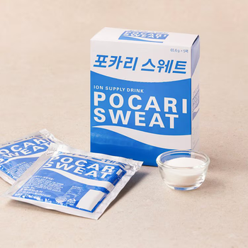
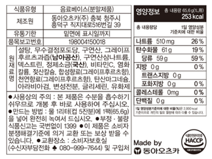
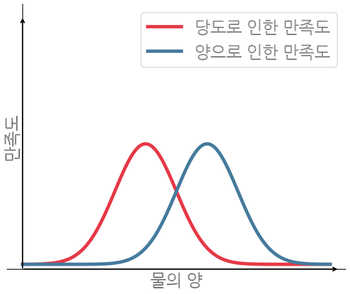

초록은 동색이라,  
한국과 일본의 합작(合作)에는 왠지 마음이 간다.

예를 들면 동아식품과 오츠카제약이 협업해서 만든 동아오츠카. 이 회사는
포카리스웨트를 만들고 있다.  
그렇다고 싫어하는 걸 억지로 좋아하는 건 아니다. 애초에 포카리스웨트는
맛있으니까.  
일본의 토레타 포지션인 Aquarius도 좋지만, 포카리 쪽이 조금 더 직관적인 맛이다.
(아쿠아리우스에는 꿀이 들어간다)

선호하는 건 보관이 쉬운 분말 타입으로, 가루를 물 1리터에 녹이면 간편하게 음료를
만들 수 있다.  
대학 2학년에 왕창 입대한 친구들이 휴가를 나올 때마다 PX에서 사 오라고 한 덕분에
한동안은 물 대신 달고 살기도 했다.

상자는 점선을 따라 꾹꾹 누르면 뜯어진다.  
점선은 흰색과 파란색의 경계를 따라 부드러운 곡선 형태다. 로고 느낌이 나는
포인트다.  
디자이너가 넌지시 말을 건네는 듯하다. 그거 만들 때 나도 있었어.  
왠지 일본인일 것 같다.

드르륵하는 소리와 함께 두꺼운 진동이 손가락에 전해진다. 상자 안쪽은 마분지
느낌의 회색이다.  
안에는 5팩이 들어있는데, 은빛이 쨍하고 빛나는 게 우주식량처럼 기술적인 분위기를
풍긴다.

맨 앞에 있는 녀석을 꺼낸다. 모서리가 꽤 날카롭다.  
‘음료베이스’라는 글자가 눈에 띈다. 껌은 껌베이스로 만든다던데 비슷한 걸까?

뒤에는 빼곡하게 성분이 적혀있다. '그레이프후르츠과즙'  
이건 '그레이프후르츠분말'일 때도 있고 '그레이프후르츠혼합분말'일 때도 있다.

이 ‘그레이프후르츠’가 자몽이라는 건 초등학생 때 우연히 알았다.  
그때는 엄청나게 당한 기분이었다. 분하다! 포카리스웨트가 자몽 맛이었다니..

​그전까지는 그레이프후르츠의 정체를 막연히 추측만 할 뿐이었다.  
일단 후르츠니까 과일인데, 그레이프는 포도. 포도면 포도지 포도과일은 뭐지?
포카리가 포도 맛은 아니니까 청포도인가?  
그렇게 살았다.

​그래서 요즘에도 이 단어를 보면 자몽이 아니라 상상 속의 과일이 떠오른다.  
하얀 오렌지처럼 생겼다. 자르면 반투명하고 허여멀건 과육이 보인다.  
한입 물면 포카리스웨트 과즙이 잔뜩.. 하지만 먹어본 적은 없다. \
\
\
팩을 가위로 자르고 1L 텀블러에 가루를 쏟아붓는다.  
새하얗다. 소금보다는 곱다. 예의바른 설탕같다.

​냉수를 채우고 뚜껑을 꽉 잠근 뒤 통째로 흔들면 편하다.  
하지만 이때 열심히 하지 않으면 가루가 덜 녹아서 싱겁다.

중학교 때 배운 용해도를 떠올리면서..  
용해 속도인 것 같기도 하고..

다 섞었으면 한 잔 따른다. 컵은 유리컵으로 하자.  
컵에 담긴 반투명한 묽은 액체 300ml.

​방금 만들어서 시원한 상태일 때는 한 번에 꿀꺽꿀꺽 마시고 싶다.  
그러면 냉기가 식도를 타고 넘어가면서 몸통에서 물을 빨아들이는 느낌이 든다.

​이때 '세포에 활력이 채워지고 있다'라고 상상하면 어쩐지 산뜻해져서 좋다.  
이온음료가 전해질을 보충한다는 개념에서 생리식염수를 연상하는 사람이 나뿐만은
아닐 것이다.

​청량감이 지나가면 천천히 뒷맛이 느껴진다.  
달지만 어딘가 짭조름한.. 여기에 자몽이 있다 이거지.  
그러나 열심히 의식해 봐도 모르겠다.

​계속 마시다 보면 아까워서 천천히 마시게 된다.  
물을 조금씩 부으면 더 먹을 수 있지만 싱거워지기 마련이다.

​그래서 최적의 지점을 찾는 방법을 고민했었다.  
물이 적을수록 진해지니까 좋지만 너무 달아도 재미없어질 것 같으니,

이런 느낌일 것 같은데, 검증을 어떻게 할까 생각하다가,  
만족도를 정확히 수치화할 방법이 떠오르지 않아서 그만뒀다.  
그 정도의 흥미였다.  
\
\
​역시 1L로 하라는 데에는 이유가 있겠지.

>  **2022년의 메모를 지운 날**\
> **2025.04.25**
